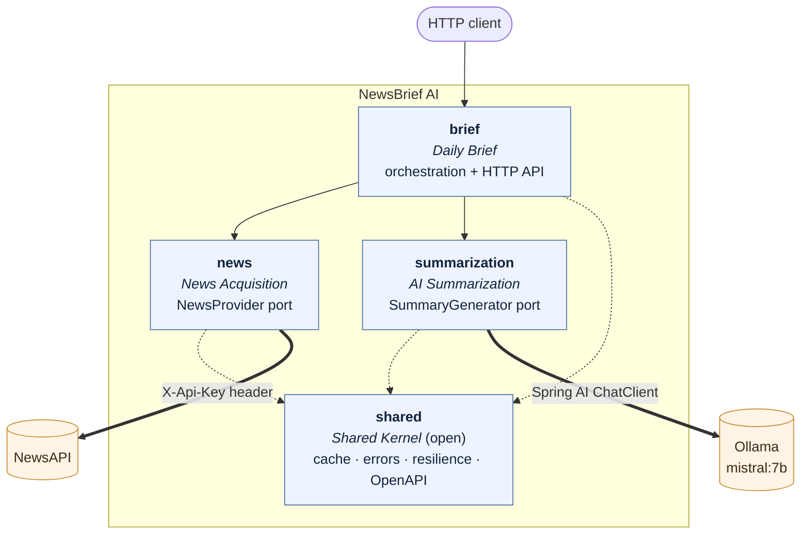

<div align="center">

# NewsBrief AI

**A daily news briefing service — current headlines in, a structured editorial summary out, written by a language model running on your own machine.**

[](https://adoptium.net/)
[](https://spring.io/projects/spring-boot)
[](https://spring.io/projects/spring-ai)
[](https://spring.io/projects/spring-modulith)
[](https://ollama.com/)
[](LICENSE)

</div>

---

## What it does

NewsBrief AI pulls the day's top headlines from [NewsAPI](https://newsapi.org), sends them to a
locally hosted [Ollama](https://ollama.com) model, and returns a single structured brief. The same
resource is served as JSON for machines and as a rendered page for people — chosen by content
negotiation, not by two different URLs.

Nothing leaves your machine except the headline request itself. The summarization happens locally.

```console
$ curl -s -H 'Accept: application/json' localhost:8080/api/v1/briefs/daily | jq
{
  "headline": "Central banks hold as markets steady",
  "overview": "Rates were left unchanged across two major economies while equity markets closed flat.",
  "topics": [
    {
      "title": "Rates held steady",
      "summary": "The central bank paused after six consecutive increases, citing cooling inflation.",
      "category": "business"
    }
  ],
  "sources": {
    "country": "us",
    "category": null,
    "articleCount": 20,
    "retrievedAt": "2026-09-08T14:20:46.386266657Z"
  },
  "generatedAt": "2026-09-08T14:20:52.118431003Z"
}
```

The same URL with `Accept: text/html` returns a readable page instead.

---

## Architecture

The application is a **modular monolith**. It deploys as one artifact, but its modules have real
boundaries: each owns a public API and hides its implementation in an `internal` package that
siblings cannot import. That rule is not a convention — [`ModularityTests`](src/test/java/com/arthur/newsbrief/ModularityTests.java)
fails the build when it is broken.



| Module | Responsibility | Public API | Depends on |
| --- | --- | --- | --- |
| `news` | Fetching and normalizing headlines | `NewsProvider`, `Article`, `Headlines`, `HeadlinesQuery` | `shared` |
| `summarization` | Turning documents into a structured summary | `SummaryGenerator`, `SourceDocument`, `NewsSummary` | `shared` |
| `brief` | Assembling the brief and publishing it over HTTP | `DailyBrief`, the REST resource | `news`, `summarization`, `shared` |
| `shared` | Cache setup, RFC 9457 errors, resilience, OpenAPI | open module — usable by all | — |

**`news` and `summarization` do not know about each other.** The summarizer accepts its own
`SourceDocument` type rather than the news module's `Article`, so the two stay independent siblings
that `brief` composes. Either upstream can be replaced without touching the other.

`ModularityTests` regenerates C4 diagrams and module canvases from the code into `target/modules/`
on every build, so the picture above can be checked against reality rather than trusted.

<details>
<summary><b>How a request flows through the modules</b></summary>

`GET /api/v1/briefs/daily`

1. **`NewsBriefController`** validates `country` and `category`, then resolves the configured default
   country. The query is fully specified from here on, which matters because it becomes a cache key.
2. **`NewsBriefService`** checks the `briefs` cache. A hit returns immediately.
3. **`NewsApiNewsProvider`** checks the `headlines` cache, then calls NewsAPI through the declarative
   client. It maps the wire format to `Article`, drops withdrawn `[Removed]` placeholders, and
   translates failures into `NewsUnavailableException` with a transient/terminal flag.
4. **`SpringAiSummaryGenerator`** caps the article list, renders the prompt template, and asks the
   model for a `NewsSummary` as typed structured output rather than free text.
5. **`NewsBriefService`** assembles a `DailyBrief` with provenance and a timestamp.
6. The controller returns JSON, or renders the same value through Thymeleaf for `text/html`.

Failures anywhere become RFC 9457 problem details via `ApiExceptionHandler`.

</details>

---

## Tech stack

| Concern | Choice | Why |
| --- | --- | --- |
| Runtime | Java 21, Spring Boot 4.1.1 | Virtual threads; the app is almost entirely I/O wait |
| Module boundaries | Spring Modulith 2.1.1 | Architecture enforced by the build, not by review |
| AI integration | Spring AI 2.0.1 (`ChatClient`) | Typed structured output; swapping model provider is config |
| HTTP client | Declarative `@HttpExchange` + `RestClient` | No hand-built URLs, no per-request `RestTemplate` |
| Caching | Caffeine, per-cache TTLs | Headlines and briefs have very different costs |
| Resilience | Spring `@Retryable` + Resilience4j circuit breakers | Retry is built into the framework; breakers add fail-fast |
| Errors | RFC 9457 `ProblemDetail` | One predictable error shape across the API |
| Docs | springdoc-openapi 3.1.1 | OpenAPI 3.1 + Swagger UI from the code |
| Tests | JUnit 6, AssertJ, WireMock, Modulith | Ports make most tests need no HTTP at all |

---

## Quick start

### Prerequisites

- A free [NewsAPI key](https://newsapi.org/register)
- Docker with Compose *(or)* Java 21 and a local Ollama for the manual route

### With Docker Compose (recommended)

```bash
cp .env.example .env      # then add your NEWS_API_KEY
docker compose up
```

Compose starts Ollama, pulls `mistral:7b` into a named volume, waits for that to finish, and only
then starts the app. The first run downloads several gigabytes; later runs reuse the volume.

```bash
open http://localhost:8080/api/v1/briefs/daily   # a rendered page
open http://localhost:8080/swagger-ui.html       # the API explorer
```

### Running locally

```bash
ollama serve &
ollama pull mistral:7b

NEWS_API_KEY=your_key ./mvnw spring-boot:run -Dspring-boot.run.profiles=dev
```

> [!NOTE]
> NewsAPI's free developer plan only serves requests from `localhost`. That is fine for local use
> and for the Compose setup, but a deployed instance needs a paid key.

---

## Configuration

Everything is overridable by environment variable. Secrets are read from `.env` in development
(via `spring.config.import`) and from the real environment everywhere else.

| Variable | Default | Purpose |
| --- | --- | --- |
| `NEWS_API_KEY` | *(required)* | NewsAPI credential. Startup fails fast with a clear message if it is missing. |
| `OLLAMA_MODEL` | `mistral:7b` | Any model your Ollama instance can serve |
| `OLLAMA_BASE_URL` | `http://localhost:11434` | Set automatically to `http://ollama:11434` under the `docker` profile |
| `SPRING_PROFILES_ACTIVE` | *(none)* | `dev` for debug logging and full health detail; `docker` for Compose |

Application settings live in [`application.yml`](src/main/resources/application.yml):

| Property | Default | Purpose |
| --- | --- | --- |
| `newsbrief.brief.default-country` | `us` | Country used when a request does not name one |
| `newsbrief.news-api.max-articles` | `20` | Articles requested per NewsAPI call |
| `newsbrief.news-api.read-timeout` | `10s` | NewsAPI must answer quickly |
| `newsbrief.summarization.max-documents` | `10` | Hard cap on articles fed into one prompt |
| `newsbrief.caching.caches.headlines` | `expireAfterWrite=5m` | Headlines go stale quickly |
| `newsbrief.caching.caches.briefs` | `expireAfterWrite=30m` | A brief costs seconds of inference |

Prompts are plain text in [`resources/prompts/`](src/main/resources/prompts) —
edit the wording without recompiling.

---

## API

Base path `/api/v1/briefs`. Full schema at `/v3/api-docs`, interactive at `/swagger-ui.html`.

### `GET /api/v1/briefs/daily`

| Parameter | Required | Values | Description |
| --- | --- | --- | --- |
| `country` | no | ISO 3166-1 alpha-2 | Defaults to `newsbrief.brief.default-country` |
| `category` | no | `business`, `entertainment`, `general`, `health`, `science`, `sports`, `technology` | Narrows the headlines |

| Status | Meaning |
| --- | --- |
| `200` | A brief, as JSON or HTML depending on `Accept` |
| `400` | Unrecognised `country` or `category` |
| `503` | NewsAPI or the model is unavailable, or its circuit breaker is open |

```bash
# JSON
curl -s -H 'Accept: application/json' localhost:8080/api/v1/briefs/daily

# The same resource as a page
curl -s -H 'Accept: text/html' localhost:8080/api/v1/briefs/daily

# Narrowed
curl -s -H 'Accept: application/json' 'localhost:8080/api/v1/briefs/daily?country=gb&category=technology'
```

Errors are [RFC 9457](https://www.rfc-editor.org/rfc/rfc9457) problem details:

```json
{
  "type": "urn:newsbrief:problem:upstream-unavailable",
  "title": "Upstream service unavailable",
  "status": 503,
  "detail": "NewsAPI responded with 401 UNAUTHORIZED",
  "instance": "/api/v1/briefs/daily",
  "upstream": "newsapi"
}
```

---

## Project structure

```
NewsBrief_IA/
├── pom.xml
├── Dockerfile                    multi-stage, layered jar, non-root
├── docker-compose.yml            app + ollama + one-shot model pull
└── src/
    ├── main/
    │   ├── java/com/arthur/newsbrief/
    │   │   ├── NewsBriefApplication.java
    │   │   ├── shared/           config · error  (open module)
    │   │   ├── news/             Article · Headlines · NewsProvider
    │   │   │   └── internal/     NewsAPI client, properties, adapter
    │   │   ├── summarization/    NewsSummary · SourceDocument · SummaryGenerator
    │   │   │   └── internal/     Spring AI adapter, properties
    │   │   └── brief/            DailyBrief · NewsBriefController
    │   │       └── internal/     NewsBriefService, properties
    │   └── resources/
    │       ├── application.yml   base + dev + docker profiles
    │       ├── prompts/          system and user prompt templates
    │       └── templates/        Thymeleaf page for the HTML representation
    └── test/java/com/arthur/newsbrief/
        └── ...                   one test package per module, mirroring main
```

Each module's `internal` package is invisible to its siblings. Public API sits in the module root.

---

## Testing

```bash
./mvnw verify
```

34 tests, no network required.

| Suite | What it covers |
| --- | --- |
| `ModularityTests` | Module boundaries; also regenerates the C4 diagrams into `target/modules/` |
| `NewsBriefServiceTest` | Orchestration, using fakes for both ports — no Spring, no HTTP |
| `NewsApiNewsProviderTest` | WireMock: mapping, header auth, retry policy, withdrawn articles, cache |
| `HeadlinesCircuitBreakerTest` | An open circuit still serves cached results |
| `SpringAiSummaryGeneratorTest` | Prompt contents, the document cap, failure translation |
| `NewsBriefControllerTest` | Content negotiation, validation, problem-detail shape |
| `BriefCachingTest` | Cache-key correctness — see the note below |

> [!IMPORTANT]
> `BriefCachingTest` exists because an earlier version cached on `#root.method.name`, a constant.
> Every distinct request collided on one entry, so the first caller's brief was served to everyone.
> These tests fail if that ever returns.

---

## Observability

| Endpoint | Shows |
| --- | --- |
| `/actuator/health` | Liveness, readiness and per-upstream circuit-breaker state |
| `/actuator/metrics` | JVM, HTTP and cache metrics |
| `/actuator/caches` | The `headlines` and `briefs` caches |
| `/actuator/prometheus` | Scrape endpoint |

Both upstreams sit behind a circuit breaker whose state is reported in `/actuator/health`, so a
failing dependency is visible before users complain about it.

---

## Design notes

### Why a modular monolith

The service started out organized by technical layer — `controller`, `service`, `client`, `dto`.
That scatters one feature across four packages and says nothing about what may depend on what.
Nothing stopped the controller from reaching into the NewsAPI wire format, and in practice it did:
it received a provider-shaped string and sliced characters off it.

A Maven multi-module build would give harder isolation, but for roughly fifteen classes the ceremony
and slower builds outweigh the benefit. Package-by-feature with build-time verification gets the same
guarantee at a fraction of the cost, and a module can still be extracted into its own artifact later
without rewriting anything.

The trade-off: `shared` has to be an open module, or the feature modules cannot reach the cache and
error infrastructure. Keeping anything feature-specific out of `shared` is a discipline the tooling
does not enforce.

### Why Spring AI, and why structured output

The original integration hand-rolled the Ollama wire format and asked the model for a full HTML page,
which the controller recovered with `summary.substring(7, length - 3)` — stripping an assumed
` ```html ` fence by character offset. When the model wrapped its reply differently, that produced
mangled output or a `StringIndexOutOfBoundsException`.

Spring AI derives a JSON schema from the `NewsSummary` record, appends it to the prompt, and parses
the reply back into an instance. There is no prose to scrape, only data to bind — which retires that
entire class of bug. JSON and HTML then render from the same typed value, so the two representations
cannot disagree, and rendering through Thymeleaf escapes its inputs, removing the stored-XSS exposure
of returning model-authored HTML verbatim. About eighty lines of HTTP plumbing were deleted.

The trade-off: structured output depends on the model honouring the schema. A smaller model may fail
to comply; the fallback is free-text summaries behind the same `SummaryGenerator` port, which is
precisely why the port exists.

### Interception order

Three proxies wrap the adapter methods, and the order is deliberate:

```
@Retryable  →  @Cacheable  →  @CircuitBreaker  →  the actual call
```

**Caching sits ahead of the breaker.** A cache hit must not travel through the circuit breaker,
because an open circuit would then suppress results the application already holds — the opposite of
what a cache is for during an outage. `HeadlinesCircuitBreakerTest` pins this.

**Retry ends up outermost.** Spring installs it through a `BeanPostProcessor`, so it wraps the advisor
chain rather than joining it. Harmless: a cache hit does not throw, so retry has nothing to act on.

### Failure handling

| Failure | Response |
| --- | --- |
| Connect or read timeout | Retried twice, exponential backoff with jitter |
| NewsAPI 5xx or 429 | Retried |
| NewsAPI 401/403, malformed request | **Not** retried — repeating it only burns quota |
| Repeated failures | Circuit opens; further calls fail fast as 503 |
| Model unreachable or off-schema | `SummarizationException` → 503 |

Timeouts are explicit on every outbound call. An unbounded HTTP client holds a request thread for as
long as the upstream cares to stall, which is the failure mode that takes a service down under load.

### Other decisions worth knowing

- **The API key travels as a header**, never a query parameter, so it cannot reach an access log.
- **The catch-all handler logs the cause and returns a generic message.** An unexpected stack trace
  can carry connection strings.
- **Queries are fully resolved before they become cache keys.** Otherwise `(null, null)` and
  `("us", null)` are two entries holding identical results.
- **Two caches, different economics.** Headlines are one cheap call but go stale fast (5 min); a
  brief costs seconds of local inference and is worth holding (30 min).

---

## Roadmap

- [ ] Scheduled generation so the morning brief is warm before the first request
- [ ] Persistence, to keep an archive of past briefs
- [ ] Per-client rate limiting on the public endpoint
- [ ] Streaming responses for the HTML representation
- [ ] A second `SummaryGenerator` adapter for a hosted model, selected by configuration

---

## License

[MIT](LICENSE) © Arthur

Headline data is supplied by [NewsAPI](https://newsapi.org) under their terms. Summaries are written
by a language model and can be wrong — verify anything that matters.
