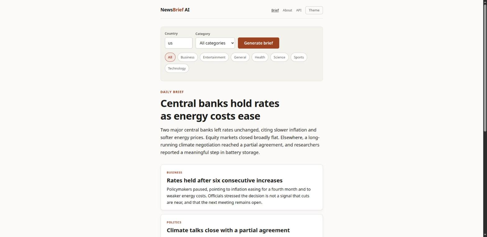
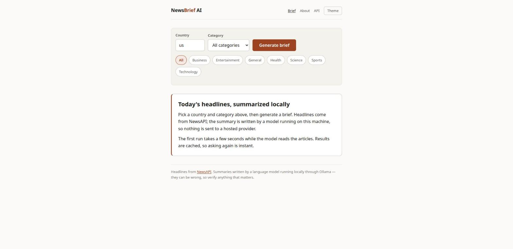
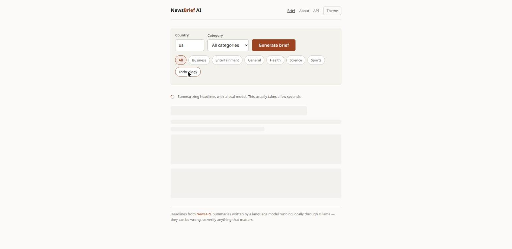
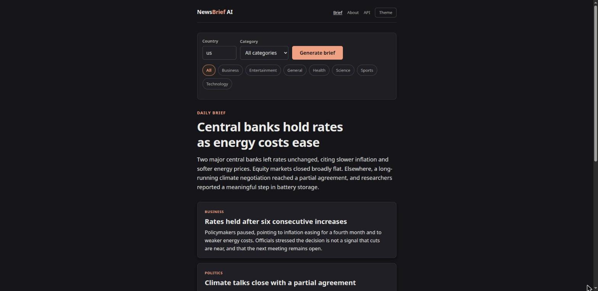
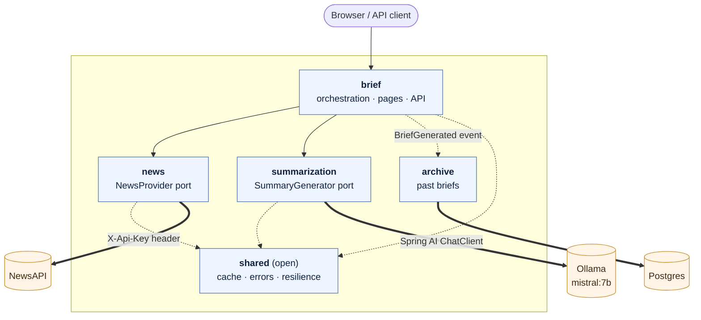

<div align="center">

# NewsBrief AI

**The day's headlines, summarized by a model running on your own machine.**
No hosted AI provider, no data leaving the box.

[](https://adoptium.net/)
[](https://spring.io/projects/spring-boot)
[](https://spring.io/projects/spring-ai)
[](https://ollama.com/)
[](#testing)
[](LICENSE)



</div>

---

## What it is

NewsBrief AI pulls current headlines from [NewsAPI](https://newsapi.org), hands them to a local
[Ollama](https://ollama.com) model, and turns them into one short editorial brief. It serves that
brief as a page for people and as JSON or markdown for programs.

The model returns **structured data, not prose** — Spring AI derives a JSON schema from a Java
record and parses the reply back into it. That is why the page and the API can never disagree:
both render from the same typed value.

| | |
|---|---|
|  |  |
| **Pick a country and a category.** | **Generation takes seconds, so it says so.** |
|  |  |
| **Follows the system theme, with a manual override.** | **Readable down to phone widths.** |

> Screenshots run against a local stub, so the headlines are representative rather than today's.
> The application, templates and styles are the real ones.

---

## Stack, and why

| Choice | Reason |
|---|---|
| **Spring Boot 4.1.1**, Java 21 | Virtual threads — almost all wall-clock time here is spent waiting on two network calls |
| **Spring Modulith 2.1.1** | Module boundaries fail the build instead of relying on code review |
| **Spring AI 2.0.1** | Typed structured output; Ollama or Anthropic, chosen by one property |
| **Thymeleaf + htmx 2.0.10** | Server-rendered, works with JavaScript off, no build step and no CDN |
| **Postgres + Spring Data JDBC** | The archive outlives the process; Flyway owns the schema |
| **Spring Modulith events** | The archive is fed by an event, so `brief` never learns it exists |
| **Caffeine** | Headlines and briefs cost wildly different amounts, so they get separate TTLs |
| **Bucket4j** | A per-client budget; Resilience4j's limiter is per-instance, the wrong shape |
| **Spring `@Retryable`** + Resilience4j | Retry is built into Framework 7; breakers add the fail-fast the framework lacks |
| **RFC 9457 `ProblemDetail`** | One predictable error shape for the API — and HTML pages for the browser |

---

## Run it

```bash
cp .env.example .env      # add your free key from https://newsapi.org/register
docker compose up
```

Compose starts Postgres and Ollama, pulls `mistral:7b` into a named volume, waits for both to be
ready, and only then starts the app. First run downloads a few gigabytes; later runs reuse the
volumes, and the archive survives `docker compose down`.

Then open **<http://localhost:8080>**.

<details>
<summary>Running without Docker</summary>

```bash
ollama serve &
ollama pull mistral:7b

docker run -d --name newsbrief-pg -p 5432:5432 \
  -e POSTGRES_DB=newsbrief -e POSTGRES_USER=newsbrief -e POSTGRES_PASSWORD=newsbrief postgres:17-alpine

NEWS_API_KEY=your_key ./mvnw spring-boot:run -Dspring-boot.run.profiles=dev
```

NewsAPI's free plan only answers requests from `localhost`, which is fine locally but means a
deployed instance needs a paid key.

</details>

---

## API

| Route | Serves |
|---|---|
| `GET /` | the app |
| `GET /briefs/daily` | the brief as a page |
| `GET /archive` | briefs from previous days |
| `GET /about` | how it is built, inside the app |
| `GET /api/v1/briefs/daily` | `application/json` or `text/markdown`, by `Accept` |
| `GET /api/v1/archive` | recently archived briefs, newest first |
| `GET /swagger-ui.html` | interactive API reference |

Optional `country` (ISO 3166-1 alpha-2) and `category` (`business`, `entertainment`, `general`,
`health`, `science`, `sports`, `technology`). Both brief endpoints are rate limited per client and
answer `429` with `Retry-After` once the budget is spent.

```bash
curl -s -H 'Accept: application/json' localhost:8080/api/v1/briefs/daily | jq
curl -s -H 'Accept: text/markdown'   'localhost:8080/api/v1/briefs/daily?category=technology'
```

<details>
<summary>Sample response and error shape</summary>

```json
{
  "headline": "Central banks hold rates as energy costs ease",
  "overview": "Two major central banks left rates unchanged, citing slower inflation.",
  "topics": [
    {
      "title": "Rates held after six consecutive increases",
      "summary": "Policymakers paused, pointing to inflation easing for a fourth month.",
      "category": "business"
    }
  ],
  "sources": { "country": "us", "category": null, "articleCount": 20,
               "retrievedAt": "2026-09-08T14:20:46Z" },
  "generatedAt": "2026-09-08T14:20:52Z"
}
```

Failures are [RFC 9457](https://www.rfc-editor.org/rfc/rfc9457) problem details:

```json
{
  "type": "urn:newsbrief:problem:upstream-unavailable",
  "title": "Upstream service unavailable",
  "status": 503,
  "detail": "NewsAPI responded with 401 UNAUTHORIZED",
  "upstream": "newsapi"
}
```

The browser gets an HTML page for the same failure instead — a scoped `@ControllerAdvice` takes
precedence over the global one for the page routes.

</details>

---

## Architecture

One deployable artifact, five modules with **enforced** boundaries. Each exposes a small public API
and hides the rest in an `internal` package siblings cannot import.



**`news` and `summarization` do not know about each other.** The summarizer takes its own
`SourceDocument` type rather than the news module's `Article`, so the two stay independent siblings
that `brief` composes. Either upstream can be replaced without touching the other.

<details>
<summary><b>How a request flows through the modules</b></summary>

1. **`BriefPageController`** validates `country` and `category`, then resolves the configured
   default. The query is fully specified from here on — it becomes a cache key.
2. **`NewsBriefService`** checks the `briefs` cache. A hit returns immediately.
3. **`NewsApiNewsProvider`** checks the `headlines` cache, then calls NewsAPI through a declarative
   `@HttpExchange` client. It maps the wire format to `Article`, drops withdrawn `[Removed]`
   placeholders, and translates failures with a transient/terminal flag.
4. **`SpringAiSummaryGenerator`** caps the article list, renders the prompt template, and asks for
   a typed `NewsSummary`.
5. **`NewsBriefService`** assembles a `DailyBrief` with provenance and a timestamp.
6. The controller renders it — or returns just the fragment when htmx is driving the request.

</details>

<details>
<summary><b>How the archive stays decoupled</b></summary>

`brief` publishes a `BriefGenerated` event. `archive` listens with `@ApplicationModuleListener`
and writes a row. Nothing in `brief` imports anything from `archive` — archiving could be deleted
tomorrow and the brief would still generate.

Spring Modulith writes the publication into an event log **inside the publishing transaction**.
If the listener never completes — process killed mid-write, database briefly unreachable — the
publication stays incomplete and is retried on the next start instead of being silently lost.
That is the difference between an event and a fire-and-forget method call.

Two details worth knowing:

- The event is published from a small transactional bean of its own, **not** from the method that
  generates the brief. Generation is tens of seconds of inference; wrapping that in a database
  transaction would hold a connection open for the whole time.
- The archive owns its own `/archive` routes. Having `brief` read the archive back would close a
  cycle — `archive` already depends on `brief` for the event type — and `ModularityTests` fails
  the build on cycles.

</details>

<details>
<summary><b>Why a modular monolith, and not layers or a multi-module build</b></summary>

The service began organized by technical layer — `controller`, `service`, `client`, `dto`. That
scatters one feature across four packages and says nothing about what may depend on what. Nothing
stopped the controller from reaching into the NewsAPI wire format, and in practice it did: it
received a provider-shaped string and sliced characters off it.

A Maven multi-module build would give harder isolation, but for roughly twenty classes the ceremony
and slower builds outweigh the benefit. Package-by-feature with build-time verification gets the
same guarantee far cheaper, and a module can still be extracted later without rewriting anything.

The trade-off: `shared` has to be an open module, and keeping anything feature-specific out of it
is a discipline the tooling does not enforce.

</details>

<details>
<summary><b>Why Spring AI, and why structured output</b></summary>

The original integration hand-rolled the Ollama wire format and asked the model for a full HTML
page, which the controller recovered with `summary.substring(7, length - 3)` — stripping an assumed
markdown fence by character offset. When the model phrased its reply differently, that produced
mangled output or a `StringIndexOutOfBoundsException`.

Asking for a typed record retires that entire class of bug: there is no prose to scrape, only data
to bind. Rendering through Thymeleaf also escapes its inputs, removing the stored-XSS exposure of
returning model-authored HTML verbatim. About eighty lines of HTTP plumbing were deleted.

The trade-off: structured output depends on the model honouring the schema. A smaller model may
fail to comply; the fallback is free-text behind the same `SummaryGenerator` port, which is
precisely why the port exists.

</details>

<details>
<summary><b>Interception order, and how failure is handled</b></summary>

Three proxies wrap the adapter methods:

```
@Retryable  →  @Cacheable  →  @CircuitBreaker  →  the actual call
```

**Caching sits ahead of the breaker.** A cache hit must not travel through the circuit breaker,
because an open circuit would then suppress results the application already holds — the opposite of
what a cache is for during an outage. `HeadlinesCircuitBreakerTest` pins this.

**Retry ends up outermost.** Spring installs it through a `BeanPostProcessor`, so it wraps the
advisor chain rather than joining it. Harmless: a cache hit does not throw.

| Failure | Response |
|---|---|
| Connect or read timeout | Retried twice, exponential backoff with jitter |
| NewsAPI 5xx or 429 | Retried |
| NewsAPI 401/403, malformed request | **Not** retried — repeating it only burns quota |
| Repeated failures | Circuit opens; further calls fail fast |
| Model unreachable or off-schema | `SummarizationException` → 503 |

Timeouts are explicit on every outbound call. An unbounded HTTP client holds a request thread for
as long as the upstream cares to stall, which is the failure mode that takes a service down.

The "generate again" button carries `@ConcurrencyLimit(1)`: each press costs tens of seconds of
CPU, and without it a few impatient clicks would start that many models in parallel.

</details>

<details>
<summary><b>Project structure</b></summary>

```
src/main/
├── java/com/arthur/newsbrief/
│   ├── shared/           config · error            (open module)
│   ├── news/             Article · NewsProvider
│   │   └── internal/     NewsAPI client, properties, adapter
│   ├── summarization/    NewsSummary · SummaryGenerator
│   │   └── internal/     Spring AI adapter, prompts
│   └── brief/            DailyBrief · JSON + markdown API
│       ├── web/          pages, htmx fragments, HTML errors
│       └── internal/     orchestration, markdown rendering
└── resources/
    ├── application.yml   base + dev + docker profiles
    ├── db/migration/     Flyway schema for the archive
    ├── prompts/          system and user prompt templates
    ├── static/           app.css · app.js
    └── templates/        pages, fragments, error pages
```

</details>

---

## Testing

```bash
./mvnw verify
```

60 tests. The 45 unit and slice tests need nothing; the 15 that exercise the archive and the full
context start a Postgres through Testcontainers, and **skip with a reason** when Docker is
unavailable rather than reporting a broken suite.

| Suite | Covers |
|---|---|
| `ModularityTests` | Module boundaries; regenerates C4 diagrams into `target/modules/` |
| `NewsBriefServiceTest` | Orchestration against fakes — no Spring, no HTTP |
| `NewsApiNewsProviderTest` | WireMock: mapping, header auth, retry policy, caching |
| `HeadlinesCircuitBreakerTest` | An open circuit still serves cached results |
| `SpringAiSummaryGeneratorTest` | Prompt contents, document cap, failure translation |
| `NewsBriefControllerTest` | JSON and markdown negotiation, problem-detail shape |
| `BriefPageControllerTest` | Pages, htmx fragments, and **errors as HTML rather than JSON** |
| `BriefCachingTest` | Cache-key correctness |
| `BriefArchiveIntegrationTest` | An event published by `brief` becomes a row, against real Postgres |
| `ClientRateLimitFilterTest` | Per-client budgets, `X-Forwarded-For`, paths left alone |
| `BriefWarmupTest` | The scheduled job regenerates, and survives an upstream outage |
| `SummarizationProviderSelectionTest` | Exactly one `ChatClient`, chosen by property |

> `BriefCachingTest` exists because an earlier version cached on `#root.method.name`, a constant.
> Every distinct request collided on one entry, so the first caller's brief was served to everyone.

Health, metrics and per-upstream circuit-breaker state are at `/actuator/health`.

---

## License

[MIT](LICENSE) © Arthur

Headline data from [NewsAPI](https://newsapi.org) under their terms. Summaries are written by a
language model and can be wrong — verify anything that matters.
